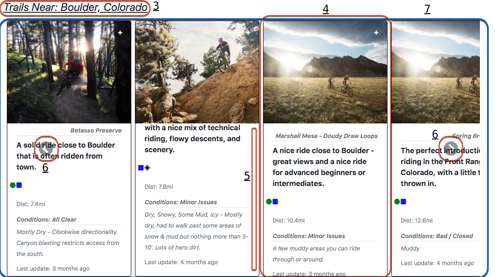

# MTB Trail Companion v1.1
*powered by MTB Project API*

## Search the US for MTB trails. Includes names, descriptions, difficulty, distance and (usually) current conditions.

## Getting Started:

- Install Dependencies:
```
$ npm install
```
*NOTE: .env files not supplied*

- Start webpack
```
$ npm run react-dev
```

- Start Server
```
$ npm start
```

## App Layout:


```
Search Bar -
  1. Input box for location search.
  2. Submit button. Obvi
```



```
Trails Carousel -
  3. Display location of search results.
  4. Trail cards - all loaded from MTB Project API.
    - img
    - Trail name
    - Description
    - Diffuculty - converted to ski style notation
    - Distance
    - Conditions
    - Condition details
    - Stamp for last conditions update
  5. Vertical scroll for data overflow.
  6. Previous/Next carousel buttons.
  7. Carousel container.
```

Built with:
- MTB Project API
- React.js
- Bootstrap
- Express
- Request
- Moment.js


