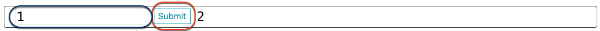

# MTB Trail Companion v1.1
*powered by MTB Project API*

###### Search the US for MTB trails

## Getting Started:

- Install Dependencies:
```
$ npm install
```
*NOTE: .env files not supplied*

- Start webpack
```
$ npm run react-dev
```

## App Layout:



- Search Bar. -
  1. Input box for location search.
  2. Submit button. Obvi


